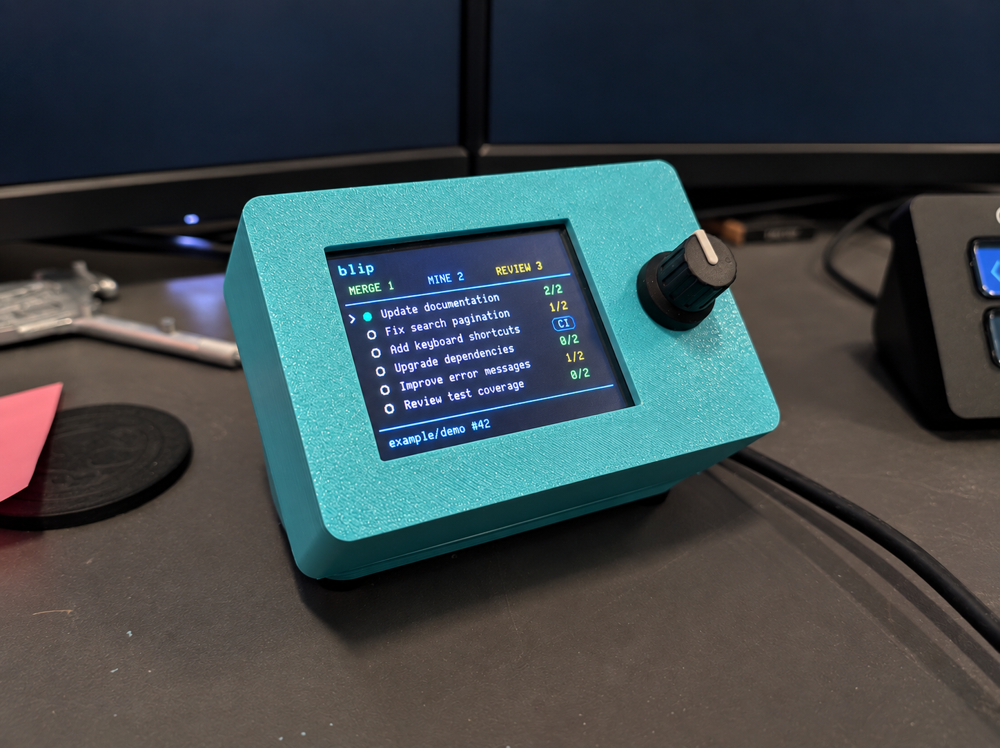
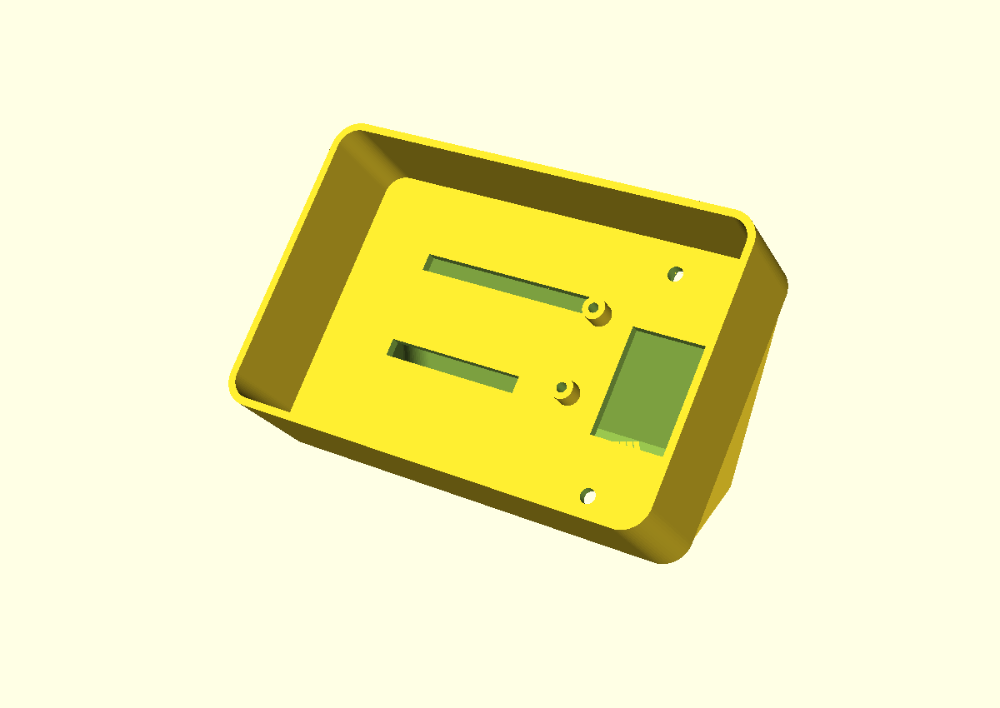

# blip

**Brian’s Little Information Panel.** A little physical home for your GitHub queue:
TinyGo, a color screen, a clickable knob, and a 3D-printed case.

Turn the knob to select something. Click to open it in your computer’s default
browser. Swipe the screen to scroll. One dashboard, no pages or menus.



*AI privacy edit of the working desk prototype photo: LCD content is fictional
and background monitors are blanked. [Image provenance](docs/images/README.md).*

## What it does

- **Merge:** your PRs that meet the dashboard’s review rules, with failing checks and
  merge conflicts keeping them out of the ready queue. Pending CI is shown with
  a spinner and can still appear here.
- **Mine:** your other PRs, with approval counts, LGTM labels, and CI status.
- **Review:** open, non-draft PRs requesting your review, oldest updated first,
  while they still have fewer than the configured number of approvals. PRs with
  running or failing CI, or merge conflicts, stay hidden until resolved.
- **Urgent:** optional GitHub issue Priority filtering, excluding blocked work.
- **Across repositories:** discover relevant PRs across configured organizations
  and personal accounts; skip archived repositories.
- **Extra authors:** optionally treat Dependabot and configured GitHub accounts
  as yours, hiding their PRs assigned exclusively to somebody else.
- **Comments:** unread human comments on subscribed issues and PRs. Click to open
  the specific comment and clear the alert locally; new comments bring it back.
  Drafts are excluded, queued items appear once, and standalone PR alerts cover
  conversations you've participated in or direct mentions.
- **Deployments:** unresolved failures from configured production workflows.
  These stay visible until a later successful deployment. PR CI failures remain
  in the existing PR status display.

Running checks get a spinner. Long selected titles marquee. Turn past either end
of the list to clear the selection and stop the scrolling title. The footer shows
the item number, repository, and status. Content updates only repaint when the
content changes; animations update their own small regions.

Clicking opens a GitHub page—even when the displayed data is stale. **Blip never
merges a PR, submits a review, or changes an issue.** The Merge section is a personal
queue; GitHub remains authoritative about mergeability and branch protection.

## How it works

```text
GitHub ← authenticated gh CLI ← Go companion on your computer
                                      ↕ USB serial
                              Feather RP2040 + TinyGo
                                ↙              ↘
                           TFT screen       rotary knob
```

The companion fetches GitHub data and opens links. The Feather handles display,
selection, touch scrolling, and button presses. Credentials stay on the computer;
the device receives display data and repository/item IDs, never access tokens.
There is no hosted backend or Wi-Fi setup.

macOS is the tested host. Linux has serial support and an `xdg-open` path, but has
not been hardware-tested. The screen is a **2.4-inch, 320 × 240 color TFT** with
resistive touch.

## Hardware

| Qty | Part |
| --- | --- |
| 1 | [Adafruit Feather RP2040 — #4884](https://www.adafruit.com/product/4884) |
| 1 | [2.4-inch TFT FeatherWing V2 — #3315](https://www.adafruit.com/product/3315) |
| 1 | [STEMMA QT rotary encoder breakout — #4991](https://www.adafruit.com/product/4991) |
| 1 | [Rotary Encoder + Extras — #377](https://www.adafruit.com/product/377), including knob |
| 1 | [100 mm STEMMA QT cable — #4210](https://www.adafruit.com/product/4210) |
| 1 | USB-C **data** cable |
| 1 | Short flexible USB-C extension for routing through the case |
| — | M2.5 board screws, M3 case screws, rubber feet, hookup wire and printed parts |

You will also need soldering tools and a printer or printing service. No battery,
SD card, or breadboard is required. See the [assembly guide](enclosure/v2/ASSEMBLY.md)
for screw lengths, wiring, and the current fit limitations before buying or printing.

For a first bench test, the Feather can plug directly into the FeatherWing’s two
header sockets; match the pin labels. Solder the rotary encoder into its breakout
and connect the breakout’s QT cable to the **Feather’s QT port**.

The compact case relocates the Feather using eight wires: **3.3V, GND, SCK, MOSI,
D9, D10, SDA, SCL**. Important: use the FeatherWing’s **3.3V socket, second from
RST**; the next socket is AREF. The [wiring guide](enclosure/v2/ASSEMBLY.md#eight-wire-connection)
explains the orientation and optional connections.

## Get it running

Requires Go matching [go.mod](go.mod) (currently 1.26.6+), TinyGo 0.42+, and the
GitHub CLI. Python 3 is only needed for the optional macOS service installer and
CAD utilities; OpenSCAD is needed to regenerate the printed parts.

```sh
git clone https://github.com/BrianLeishman/blip.git
cd blip
gh auth login
make all
```

For the first flash, hold **BOOTSEL**, tap **RESET**, then release BOOTSEL. Copy
`build/blip.uf2` to the `RPI-RP2` drive. Before the companion connects, the hardware
test screen shows knob position and click counters.

```sh
cp blip.example.json blip.local.json
# Edit blip.local.json: replace the example owners with yours.
make run
```

The companion detects the connected Adafruit serial device and reconnects after
unplugging it. Use `./build/blip -port /dev/cu.usbmodem…` if detection is ambiguous.
`make probe` prints hardware events; `./build/blip -once` prints a GitHub snapshot
without connecting to the device. The latter can include private repository data.

To keep the companion running at login on macOS:

```sh
python3 scripts/macos-service.py
# To remove it later:
python3 scripts/macos-service.py --uninstall
```

Before probing or flashing, stop the service so only one process owns the port:

```sh
launchctl bootout gui/$(id -u)/com.brianleishman.blip
make flash
python3 scripts/macos-service.py
```

See [configuration and dashboard behavior](docs/dashboard.md) for review rules,
urgent issue queries, polling limits, stale data, and troubleshooting.

## Printed enclosure

OpenSCAD source and printable STLs are included. The case is meant to be tinkered
with: a tilted screen, knob on the right, a hollow base, and a rear USB cable plate.



*CAD render of the latest revision. This is newer than the case in the photo and
has not yet been physically printed and verified.*

The photographed build works, but the rotary fit is tight and wiring space needs
improvement. The latest CAD moves the sidewalls onto the rear shell, outside the
fit-tested face area, and adds clearance slots for the Feather’s pins. It still
uses **two Feather posts**; four slightly taller posts are planned, not implemented.

- [Assembly and print instructions](enclosure/v2/ASSEMBLY.md)
- [Parametric OpenSCAD source](enclosure/v2/assembly.scad)
- [Front plate STL](enclosure/stl/v2-front-m25.stl)
- [Rear shell/base STL](enclosure/stl/v2-stand.stl)
- [USB plate STL](enclosure/stl/v2-usb-plate.stl)
- [All three parts, arranged for printing](enclosure/stl/v2-print-layout.stl)

```sh
make enclosure-v2
```

The combined STL is a layout of **three separate parts**, not an assembled solid.
Mesh and modeled-clearance checks help catch CAD mistakes, but do not validate
real wire bends, printer tolerances, or physical fit. Earlier enclosure experiments
remain in [enclosure/](enclosure/README.md).

## Development and privacy

```sh
make test       # Go tests and vet
make firmware   # TinyGo build, without flashing
```

`firmware/` drives the hardware, `dashboard/` shares the wire model and list behavior,
and `cmd/blip/` plus `internal/github/` implement the companion.

Personal configuration, build output, logs, and environment files are ignored.
Do not commit live snapshots or unredacted photos: titles, repository names, and
computer screens can reveal private work even without a token. See
[security and privacy notes](SECURITY.md) before sharing diagnostics.

## License

MIT. Dependencies keep their own licenses. Adafruit’s hardware designs are
separately licensed and linked as dimensional references; their PCB files are not
vendored here.
